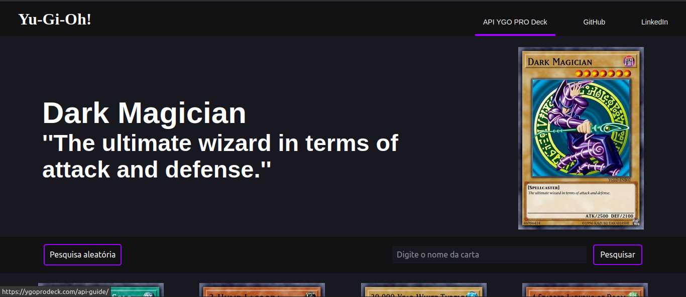
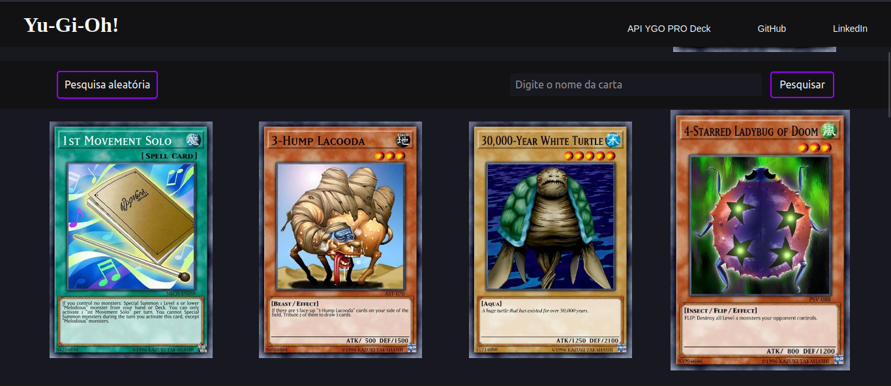
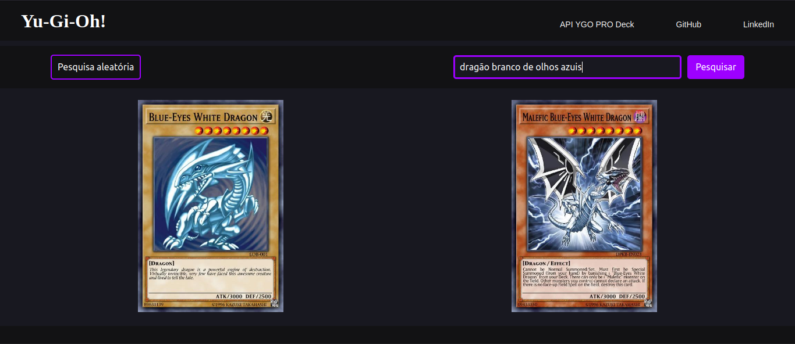
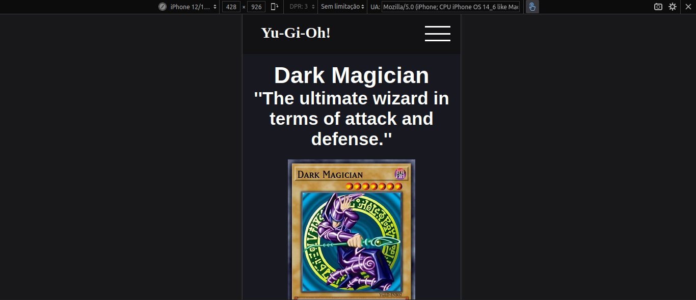
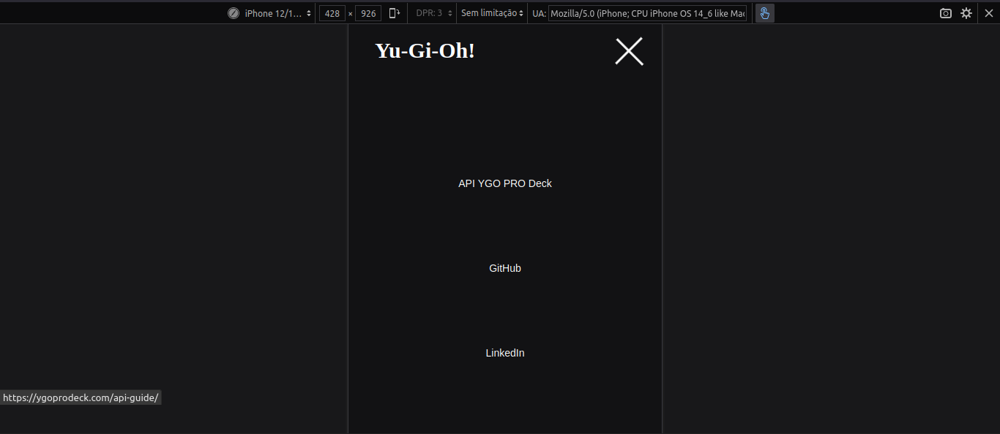
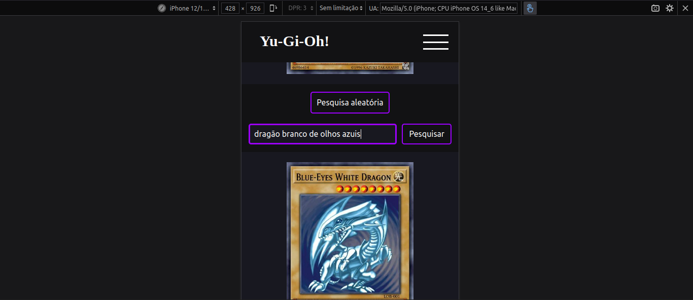

### Project made in React for to render Yu-Gi-Oh cards through an API

A Yu-Gi-Oh inspired project that mades with React available through an API YGOPRODeck API (https://ygoprodeck.com/api-guide/) a site with Yu-Gi-Oh cards.

### Below have some images:

#### Examples of show and search cards by name in computer




#### Examples of show and search cards by name in mobile




### Installation

After downloading this project, make sure you have NodeJS installed on your machine by running the following command:

```bash
node --version
```

The command should to return the NodeJS installed version. If It doesn't return, download it.

### Running the project

After installing Node JS, you will need to download the necessary modules, for that, inside the terminal, in the project folder, execute the command:

You can use your preferred package manager (npm, yarn, etc.) to install all dependencies, in my case I used npm:

```bash
npm install
```

Then run the following command:

```bash
npm run dev
```

The React project will be run on localhost (on some port) and the address will be displayed in the terminal. Put the address in the browser of your choice.

[Click here to see the site Yu-Gi-Oh! Cards](https://yugioh-cards-mateusesm.vercel.app/)
